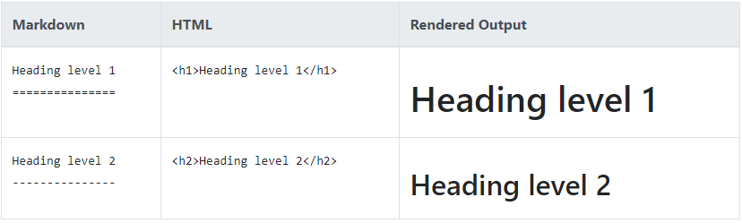

# Advanced-Markdown-Syntax
## Table of contents
## [Good cheat sheet of Basic syntax can be found here](https://www.markdownguide.org/basic-syntax/#overview).

### Here's some highlights of that Basic Syntax

<details>
  <summary>=== and ---</summary> 
 === is the same as # for header one, and --- is the same as ## header 2
for example 
</details>


<details>
  <summary> spaces and new lines</summary> 

<details>
  <summary>&nbsp;&nbsp;&nbsp; Spaces</summary> 
<table>
<tr><th>Markdown</th><th>HTML</th></tr>
<tr><td>just use the Space Bar</td><td> Use the non breaking space entity <strong>&amp;nbsp;</strong></td></tr>
</table>
</details>


<details>
<summary>&nbsp;&nbsp;&nbsp; New Lines</summary> 
<table>
<tr><th>Markdown</th><th>HTML</th></tr>
<tr><td>you can end a line by adding two or more spaces at the end</td><td> Use the breaking line tag<strong>&lt;br></strong></td></tr>
</table>
</details>


<details>
<summary>&nbsp;&nbsp;&nbsp; New Lines in a Table</summary> 
<strong>This is not Possible, What you can do instead is this</strong> <pre>
<Code>
| Status | Response  |
| ------ | --------- |
| 200    | `json`                          |
|        | `   {`                          |
|        | ` "id": 10,`                    |
|        | ` "username": "alanpartridge",` |
|        | ` more code...`                 |
|        | `}`                             |
| 400    |                                 |

</Code>
</pre>

### <strong>or use HTML just like this</strong>


```
<code>
<pre>
<table>
<tr><th>Status</th><th>Response</th></tr>

<tr><td><pre><br/><br/><br/>200<br/><br/><br/><br/><br/>400<br/></pre>
</td>
<td>
<pre>
json
  {
    "id": 10,
    "username": "alanpartridge",
    "email": "alan@alan.com",
    "password_hash": "$2a$10$uhUIUmVWVnrBWx9rrDWhS.CPCWCZsyqqa8./whhfzBZydX7yvahHS",
    "password_salt": "$2a$10$uhUIUmVWVnrBWx9rrDWhS.",
    "created_at": "2015-02-14T20:45:26.433Z",
    "updated_at": "2015-02-14T20:45:26.540Z"
}
</pre>
</td>
</tr>
</table>
```


### if you just put it in the code it will appear like:


<table>
<tr><th>Status</th><th>Response</th></tr>
<tr><td><pre><br/><br/><br/>200<br/><br/><br/><br/><br/>400<br/></pre>
</td>
<td>
<pre>
json
  {
    "id": 10,
    "username": "alanpartridge",
    "email": "alan@alan.com",
    "password_hash": "$2a$10$uhUIUmVWVnrBWx9rrDWhS.CPCWCZsyqqa8./whhfzBZydX7yvahHS",
    "password_salt": "$2a$10$uhUIUmVWVnrBWx9rrDWhS.",
    "created_at": "2015-02-14T20:45:26.433Z",
    "updated_at": "2015-02-14T20:45:26.540Z"
}
</pre>
</td>
</tr>
</table>


### or maybe use something like this
```
Status | Response
:----- | :-------
200    | <code>json {"id": 10,"username": "created_at": "2015-02-14T20:45:26.433Z" }</code>
400    | <code>json {"id": 10,"username": "alanpartridge", "email": "alan@alan.com": "2015-02-14T20:45:26.433Z"}</code>
```

### which will be rendered as 

Status | Response
:----- | :-------
200    | <code>json {"id": 10,"username": "created_at": "2015-02-14T20:45:26.433Z" }</code>
400    | <code>json {"id": 10,"username": "alanpartridge", "email": "alan@alan.com": "2015-02-14T20:45:26.433Z"}</code>

</details>


<details>
  <summary>&nbsp;&nbsp;&nbsp;you may need the &lt;pre> Tag</summary>
Text in a &lt;pre> Tag preserves both spaces and line breaks.

Markdown treats multiple blank lines as one blank line, you could &lt;pre> tag to contain blank lines. As markdown inside pre block is not parsed. I would prefer not to do this, instead add as many &lt;br>'s as needed.
</details>

----------
</details>


<details>
  <summary>Escaping Backticks</summary>
  you can use the html entity &grave&semi;   
  or alternativlly you can do this
  

</details>


<details>
  <summary>indentation several lines by four spaces or one tab</summary>
  This creates a code blocks and it's the same as using &grave;&grave;&grave; code&grave;&grave;&grave;
</details>


<details>
  <summary>Horizontal Rules</summary> 


</details>


<details>
  <summary>Escaping Characters</summary>  
 To display a literal character that would otherwise be used to format text in a Markdown document, add a backslash (\) in front of the character.

 <table class="table table-bordered">
  <thead class="thead-light">
    <tr>
      <th>Character</th>
      <th>Name</th>
    </tr>
  </thead>
  <tbody>
    <tr>
      <td>\</td>
      <td>backslash</td>
    </tr>
    <tr>
      <td>`</td>
      <td>backtick </td>
    </tr>
    <tr>
      <td>*</td>
      <td>asterisk</td>
    </tr>
    <tr>
      <td>_</td>
      <td>underscore</td>
    </tr>
    <tr>
      <td>{ }</td>
      <td>curly braces</td>
    </tr>
    <tr>
      <td>[ ]</td>
      <td>brackets</td>
    </tr>
    <tr>
      <td>&lt; &gt;</td>
      <td>angle brackets</td>
    </tr>
    <tr>
      <td>( )</td>
      <td>parentheses</td>
    </tr>
    <tr>
      <td>#</td>
      <td>pound sign</td>
    </tr>
    <tr>
      <td>+</td>
      <td>plus sign</td>
    </tr>
    <tr>
      <td>-</td>
      <td>minus sign (hyphen)</td>
    </tr>
    <tr>
      <td>.</td>
      <td>dot</td>
    </tr>
    <tr>
      <td>!</td>
      <td>exclamation mark</td>
    </tr>
    <tr>
      <td>|</td>
      <td>pipe</td>
    </tr>
  </tbody>
</table>

 </details>


<details>
<summary>Github Markdown Supports HTML Tag so you can just write HTMl and it would be Rendered
For example : </summary>  

Consider the Following Code
```
<code>
<pre>
<table>
<tr><th>Status</th><th>Response</th></tr>

<tr><td><pre><br/><br/><br/>200<br/><br/><br/><br/><br/>400<br/></pre>
</td>
<td>
<pre>
json
  {
    "id": 10,
    "username": "alanpartridge",
    "email": "alan@alan.com",
    "password_hash": "$2a$10$uhUIUmVWVnrBWx9rrDWhS.CPCWCZsyqqa8./whhfzBZydX7yvahHS",
    "password_salt": "$2a$10$uhUIUmVWVnrBWx9rrDWhS.",
    "created_at": "2015-02-14T20:45:26.433Z",
    "updated_at": "2015-02-14T20:45:26.540Z"
}
</pre>
</td>
</tr>
</table>
```


### if you just put it in the code it will appear like:


<table>
<tr><th>Status</th><th>Response</th></tr>
<tr><td><pre><br/><br/><br/>200<br/><br/><br/><br/><br/>400<br/></pre>
</td>
<td>
<pre>
json
  {
    "id": 10,
    "username": "alanpartridge",
    "email": "alan@alan.com",
    "password_hash": "$2a$10$uhUIUmVWVnrBWx9rrDWhS.CPCWCZsyqqa8./whhfzBZydX7yvahHS",
    "password_salt": "$2a$10$uhUIUmVWVnrBWx9rrDWhS.",
    "created_at": "2015-02-14T20:45:26.433Z",
    "updated_at": "2015-02-14T20:45:26.540Z"
}
</pre>
</td>
</tr>
</table>

### if you want to write an html code and disable it put it inside &grave;&grave;&grave; code &grave;&grave;&grave;
</details>

---------
## Advanced Syntax

<br />
